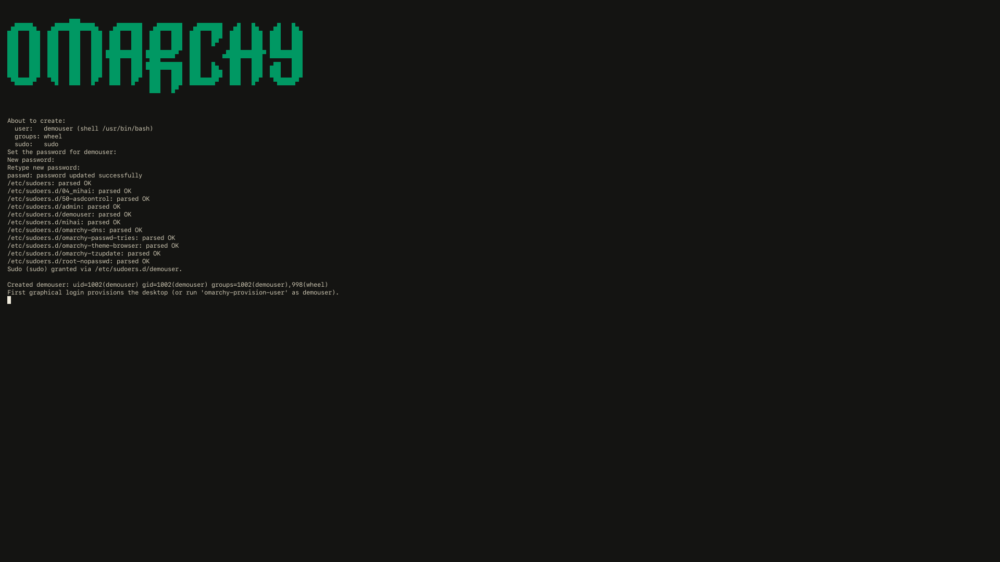

# omarchy-custom

SDDM theme cloned from Omarchy, with user and session dropdowns under a
centered login.


Repo: https://github.com/nightdevil00/omarchy-custom

## Install from git

```bash
git clone https://github.com/nightdevil00/omarchy-custom.git
cd omarchy-custom
./install.sh
```

Options:

- `--dry-run` — print what would be done
- `--no-enable` — copy files but don't write `/etc/sddm.conf.d/zz-omarchy-custom-theme.conf`
- `--keep-autologin` — don't remove `/etc/sddm.conf.d/autologin.conf`
- `-h, --help` — usage

## All-in-one: theme + user

One call installs the theme, creates a user in the given groups, sets its
password, and optionally grants sudo:

```bash
./install.sh --add-user alice --groups wheel --sudo
```

- `--groups <g1,g2>` — supplementary groups (default: `wheel`); must exist.
- `--sudo` — sudo with password; `--sudo-nopasswd` — passwordless sudo
  (like the stock Omarchy users). Both write `/etc/sudoers.d/<name>`.
- `--skip-password` — don't touch the password (groups/sudo only).
- Existing users are kept and just updated (groups re-applied).

The script resolves theme sources relative to itself, so it works from any
clone path. Existing installs are backed up to `/var/backups/omarchy-custom-sddm/`.

Takes effect on next SDDM greeter (logout/reboot). Test now (logs you out):

```bash
sudo systemctl restart sddm
```

See [multi-user.md](multi-user.md) for multi-user setup: adding users with
groups/sudo, disabling autologin, and troubleshooting.

## User admin scripts (`bin/`)

Standalone admin tools in the Omarchy CLI style (gum TUI, `omarchy:` metadata,
logo via `omarchy-show-logo` when on Omarchy). Separate flow from `install.sh`,
written so they could be proposed upstream:

| Script | Does |
| ------ | ---- |
| `bin/omarchy-add-user` | Create a user: gum prompts for name, group checklist, sudo level, then `passwd` |
| `bin/omarchy-remove-user` | Remove a user (never root/system/self), optionally home + managed sudo grant |
| `bin/omarchy-set-privileges` | Set sudo level: `password`, `nopasswd`, or `none` (validated drop-in) |
| `bin/omarchy-change-groups` | Change supplementary groups: checklist, `--add`, `--remove`, or `--set` |

```bash
./bin/omarchy-add-user                        # fully interactive
./bin/omarchy-add-user alice --groups wheel --sudo --yes   # scripted
./bin/omarchy-set-privileges alice --level nopasswd --yes
./bin/omarchy-change-groups alice --add docker --yes
./bin/omarchy-remove-user alice --remove-home --yes
```

Every destructive step confirms (bypass with `--yes`); every sudoers write is
`visudo -c` validated. Run `--help` on any script for its usage.

### Walkthrough (screenshots)

Full run with a demo user, every screen captured in [`screenshots/`](screenshots/):

**`omarchy-add-user`** — username prompt, group checklist, sudo level,
summary confirm, password prompt, done:




**`omarchy-set-privileges`** — pick user, pick level, confirm, done:


**`omarchy-change-groups`** — pick user, checklist (preselected), before/after
confirm, done:


**`omarchy-remove-user`** — pick user, home choice, final confirm, done:


## License

MIT — see [LICENSE](LICENSE).
