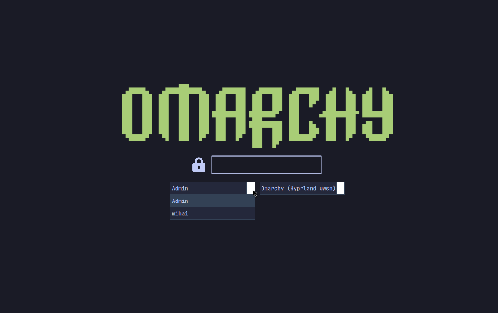

# omarchy-custom

SDDM theme cloned from Omarchy, with user list (left) and session list (right).



Repo: https://github.com/nightdevil00/omarchy-custom

## Install from git

```bash
git clone https://github.com/nightdevil00/omarchy-custom.git
cd omarchy-custom
./install.sh
```

Options:

- `--dry-run` — print what would be done
- `--no-enable` — copy files but don't write `/etc/sddm.conf.d/zz-omarchy-custom-theme.conf`
- `--keep-autologin` — don't remove `/etc/sddm.conf.d/autologin.conf`
- `-h, --help` — usage

## All-in-one: theme + user

One call installs the theme, creates a user in the given groups, sets its
password, and optionally grants sudo:

```bash
./install.sh --add-user alice --groups wheel --sudo
```

- `--groups <g1,g2>` — supplementary groups (default: `wheel`); must exist.
- `--sudo` — sudo with password; `--sudo-nopasswd` — passwordless sudo
  (like the stock Omarchy users). Both write `/etc/sudoers.d/<name>`.
- `--skip-password` — don't touch the password (groups/sudo only).
- Existing users are kept and just updated (groups re-applied).

The script resolves theme sources relative to itself, so it works from any
clone path. Existing installs are backed up to `/var/backups/omarchy-custom-sddm/`.

Takes effect on next SDDM greeter (logout/reboot). Test now (logs you out):

```bash
sudo systemctl restart sddm
```

See [multi-user.md](multi-user.md) for multi-user setup: adding users with
groups/sudo, disabling autologin, and troubleshooting.
